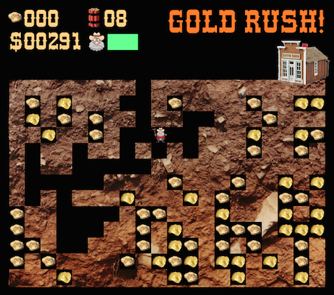

# Gold Rush!

##Background
This is a version of the Atari 400/800 game Gold Rush! which appeared in Compute! magazine in the 1980s. I did it mainly to learn Pygame, and it is not fully faithful to the original, but you can get the general idea.

This is what it looked like in the 1980s on an Atari computer:

This is our version for Pygame:

##Gameplay
Use the arrow keys to move the miner around. The jerky movement is intentional; it is an attempt to recreate the movement of the original.

To use a charge, hold down an arrow key next to a blocked area and press the space key. After the explosion the area will be clear, but beware: some parts of the mine will cave in after each explosion.

To exit the game, press the Escape key.

##Additional information
I made a script under scripts/makedigits.py which will create the assets/images/digits.py file using the western-themed font in /assets/fonts. This needs PIL to work properly.

Note that although I tried to use free images/sounds etc. where possible, there may be some that are not public domain. If I get any complaints, I will swap them out with public domain assets.

